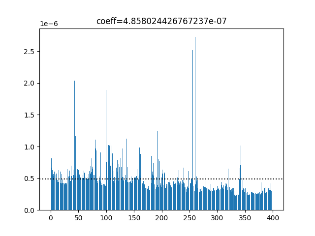
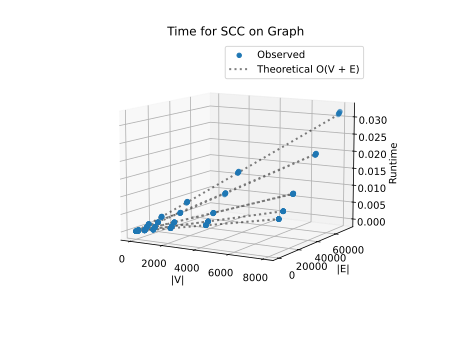
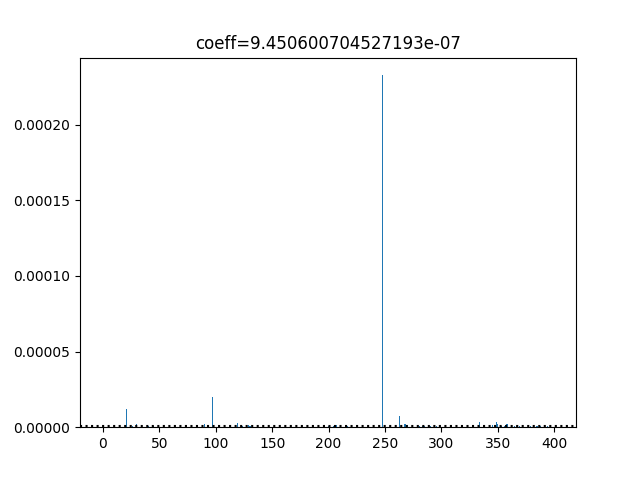
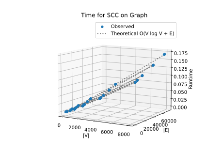

# Project Report - Network Analysis SCCs

## Baseline

### Design Experience

Adam Eubanks and Blake Calkins on 9/29/2025

For prepost, which returns the pre and post order numbers of every node in its contituent tree map, I will define a function that iterates through the graph and calls the recursive function explore on each one; the same way that the psuedocode works. Because python dictionaries preserve insertion order, I will make another dictionary to keep track of whether they've been visited, the key will be the string of the node in the dictionary and the value a bool variable.

With that, I will simply store the pre and post order numbers in the dictionary that I will eventually return.

### Theoretical Analysis - Pre/Post Order Traversal

#### Time 

##### prepost - **O(V + E)**

```py
def prepost(graph: GRAPH) -> list[dict[str, list[int]]]:
    """
    Return a list of DFS trees.
    Each tree is a dict mapping each node label to a list of [pre, post] order numbers.
    The graph should be searched in order of the keys in the dictionary.
    """
    visited: set[str] = set()
    sort_func: callable = get_sort_func(graph) # O(V)
    trees: list[dict[str, list[int]]] = []
    order_counter = 1
    for node in graph:    # O(V)
        if not node in visited:   # condition 1
            tree: dict[str, list[int]] = {}
            order_counter = explore_tree(graph, visited, sort_func, tree, node, order_counter)
            trees.append(tree)
    return trees
```

The outer part of this for loop runs V times because it iterates through each vertex of the graph. However, it doesn't always perform the same computation depending on whether the Node has been visited or not see condition 1.

```py
def explore_tree(graph, visited, sort_func, tree, node, order_counter):
    visited.add(node)
    tree[node] = [order_counter]
    order_counter += 1 # O(1)
    candidates = sorted(graph[node], key=sort_func) # O(E)
    for candidate in candidates: # O(V)
        if not candidate in visited: # condition 2
            order_counter = explore_tree(graph, visited, sort_func, tree, candidate, order_counter)
    tree[node].append(order_counter)
    order_counter += 1 # O(1)
    return order_counter
```

This function is a little difficult to annotate specifically so I'll explain. This function explore tree gets a list of candidate nodes to explore, but it doesn't need to explore all of them if they are already visited (see condition 2). The worst case here is that in the single explore function, you would have all the edges, which would mean O(E).

The other worst case is that you would have all the node, which would be O(V).

```py
def get_sort_func(graph: GRAPH):
    sort_dict: dict[str, int] = {}
    for i, node in enumerate(graph):
        sort_dict[node] = i
    def sorting_func(node: str):
        return sort_dict[node]
    return sorting_func
```

The get_sort_func function is a quite negligible O(V) as you can see because it simply iterates through the vertices of the graph and preserve that order in a map.

If you really think about it, because were not having to perform additional computations if a given node has already been visited (and this applies both for the prepost function and the explore function), you will visit a maximum of V vertices and E edges. Even though the recursive structure and for loops from prepost make it look nesting like (V * E), its actually not because you wouldn't even iterate over the V's that have already been visited. Also, E's that lead to an already visited node will not be taken in to account.

For this reason my theoretical time complexity for prepost is **O(V + E)**, which is linear time.

#### Space

##### prepost - **O(V + E)**

```py
def get_sort_func(graph: GRAPH):
    sort_dict: dict[str, int] = {}
    for i, node in enumerate(graph):
        sort_dict[node] = i
    def sorting_func(node: str):
        return sort_dict[node] # O(2E)
    return sorting_func
```

My sorting function stores a dictionary with V vertices in it. So O(2E) space there (because of the integer value stored).

```py
def prepost(graph: GRAPH) -> list[dict[str, list[int]]]:
    """
    Return a list of DFS trees.
    Each tree is a dict mapping each node label to a list of [pre, post] order numbers.
    The graph should be searched in order of the keys in the dictionary.
    """
    visited: set[str] = set() # O(V)
    sort_func: callable = get_sort_func(graph)
    trees: list[dict[str, list[int]]] = []
    order_counter = 1
    for node in graph:
        if not node in visited:
            tree: dict[str, list[int]] = {}
            order_counter = explore_tree(graph, visited, sort_func, tree, node, order_counter)
            trees.append(tree) #O(V)
    return trees
```

The graph here takes up O(V + E) space because it stores V vertices as keys and E edges as values. The visited set at the end store V vertices for O(V). Any local variables from the for loop are garbage collected each iteration such that they dont accumulate. Each tree has a maximum of V vertices for O(V). This is also the case with the list of trees because the trees partition that list.

```py
def explore_tree(graph, visited, sort_func, tree, node, order_counter):
    visited.add(node)
    tree[node] = [order_counter]
    order_counter += 1 #O(1)
    candidates = sorted(graph[node], key=sort_func) # O(E)
    for candidate in candidates:
        if not candidate in visited:
            order_counter = explore_tree(graph, visited, sort_func, tree, candidate, order_counter)
    tree[node].append(order_counter)
    order_counter += 1
    return order_counter
```

The size of the counter is negligible so I say O(1) for that. The candidates list grows to be at most E big, so O(E) there. Of course visited could be at most O(V).

In final consideration. I add up all the constituent time complexities, recognizing that the for loop of prepost garbage collects each time, and get O(3V + 3E + 2) or **O(V + E)**.

### Empirical Data

| Density Factor | Size  |    V    |    E    | Time (sec) |
| -------------- | ----- | ------- | ------- | ---------- |
| 0.25           | 10    | 10.0    | 12.8    | 0.0        |
| 0.25           | 50    | 50.0    | 61.6    | 0.0        |
| 0.25           | 100   | 100.0   | 123.5   | 0.0        |
| 0.25           | 500   | 500.0   | 616.1   | 0.001      |
| 0.25           | 1000  | 1000.0  | 1242.3  | 0.002      |
| 0.25           | 2000  | 2000.0  | 2496.5  | 0.002      |
| 0.25           | 4000  | 4000.0  | 4982.6  | 0.005      |
| 0.25           | 8000  | 8000.0  | 9967.0  | 0.011      |
| 0.5            | 10    | 10.0    | 17.7    | 0.0        |
| 0.5            | 50    | 50.0    | 85.2    | 0.0        |
| 0.5            | 100   | 100.0   | 173.1   | 0.0        |
| 0.5            | 500   | 500.0   | 872.2   | 0.001      |
| 0.5            | 1000  | 1000.0  | 1770.4  | 0.002      |
| 0.5            | 2000  | 2000.0  | 3551.4  | 0.004      |
| 0.5            | 4000  | 4000.0  | 7147.2  | 0.005      |
| 0.5            | 8000  | 8000.0  | 14361.9 | 0.012      |
| 1              | 10    | 10.0    | 24.5    | 0.0        |
| 1              | 50    | 50.0    | 134.1   | 0.0        |
| 1              | 100   | 100.0   | 272.5   | 0.0        |
| 1              | 500   | 500.0   | 1429.5  | 0.001      |
| 1              | 1000  | 1000.0  | 2921.5  | 0.002      |
| 1              | 2000  | 2000.0  | 5928.1  | 0.003      |
| 1              | 4000  | 4000.0  | 12010.6 | 0.007      |
| 1              | 8000  | 8000.0  | 24327.1 | 0.015      |
| 2              | 10    | 10.0    | 36.1    | 0.0        |
| 2              | 50    | 50.0    | 239.4   | 0.0        |
| 2              | 100   | 100.0   | 499.2   | 0.0        |
| 2              | 500   | 500.0   | 2710.2  | 0.001      |
| 2              | 1000  | 1000.0  | 5589.5  | 0.002      |
| 2              | 2000  | 2000.0  | 11450.9 | 0.004      |
| 2              | 4000  | 4000.0  | 23462.8 | 0.01       |
| 2              | 8000  | 8000.0  | 47740.4 | 0.021      |
| 3              | 10    | 10.0    | 46.0    | 0.0        |
| 3              | 50    | 50.0    | 356.9   | 0.0        |
| 3              | 100   | 100.0   | 766.3   | 0.0        |
| 3              | 500   | 500.0   | 4321.3  | 0.001      |
| 3              | 1000  | 1000.0  | 8788.2  | 0.003      |
| 3              | 2000  | 2000.0  | 17810.6 | 0.006      |
| 3              | 4000  | 4000.0  | 36212.5 | 0.012      |
| 3              | 8000  | 8000.0  | 73442.4 | 0.027      |


### Comparison of Theoretical and Empirical Results

- Theoretical order of growth: **O(V + E)** 
- Measured constant of proportionality for theoretical order: 4.858024426767237e-07



- Empirical order of growth (if different from theoretical): It's the same, O(V + E)




Note that the label here is incorrect, **it should say O(V + E) for the theoretical**. Note that the theoretical constant and the empirical constant were the same. As you can see, my theoretical almost perfectly aligns with the empirical data. In the bar graph of constants, you can see that the curve is substantially flat, which indicates that O(V + E) is the correct order in this situation.

Also, in the plot of runtimes, you can also see that the observed points miror the theoretical almost perfectly. This went exactly according to plan just as I predicted. Noise in the graph could be attributable to temporary modifications in the runtime due to random performance mishaps. Another reason could be that when appending to a list, the underlying data structure often has to allocated a new array space in memory (at least that's how c++ vectors work) and copy everything over.

## Core

### Design Experience

Adam Eubanks and Blake Calkins on 9/29/2025

I will reverse the graph given to me by iterating through the adjacency list and setting each edge that is connected to by another node to be connected to by that respective node. I will do this by iterating through the graph and creating another graph to do this during the iteration.

After running prepost on the reverse graph, I will iterate through the pre post trees and sort them based on their post order number. Then, I will run interate in the decreasing post order numbr order and run explore succesively, popping out each SCC and adding each SCC set to the list. I will then return that list.

### Theoretical Analysis - SCC

#### Time 

##### find_sccs - **O(V log V + E)**

```py
def find_sccs(graph: GRAPH) -> list[set[str]]:
    """
    Return a list of the strongly connected components in the graph.
    The list should be returned in order of sink-to-source
    """
    reverse_graph = get_reverse_graph(graph)
    prepost_trees = prepost(reverse_graph)
    node_order = get_node_order(prepost_trees)
    visited = set()
    sort_func = get_sort_func(graph)
    sccs = []
    # Section Below Here
    for node in node_order: #O(V)
        if not node in visited: # condition A
            scc = explore_primitive(graph, visited, sort_func, node, set()) #O(E)
            sccs.append(scc)
    return sccs
```

I'll comentate on the section below. The top level for loop here iterates a maximum of V times, but as in prepost, this is misleading because it doesn't do hardly any computation. In reality, it only will call explore primitive a maximum of V times if all the components are strongly connected. Because of this, the loop itself gets an O(V). In terms of this, that whole lower section would be O(V + E) becase its effetively the same as the prepost traversal.


```py
def explore_primitive(graph, visited, sort_func, node, scc):
    """Mine. all this does is explore all it can and returns everything
    that could be reached from the starting node. It doesnt worry about
    pre or post"""
    visited.add(node)
    scc.add(node)
    adjacents = sorted(graph[node], key = sort_func) #O(E) if there are E adjacents max
    for adjacent in adjacents: # O(E)
        if not adjacent in visited: # Condition B
            scc = explore_primitive(graph, visited, sort_func, adjacent, scc)
    return scc
```

This pops out SCCs. The maximum number of adjacents here is how many edges there all in the graph (assuming every edges leads from this one node). However, it doesn't compute through every adjacent if its been visited, but even the time in this loop consideration is significant because there isn't as much overhead with counting like in prepost. This means that explore_primitive will have a worst case of traversing E edges for O(E). This assumes that the whole graph is one SCC or there are are unreachable SCCs.

```py
def get_node_order(prepost_trees: list[dict[str, list[int]]]):
    node_post_orders: list[tuple[str, int]] = []
    for tree in prepost_trees:
        for node, orders in tree.items(): # O(V)
            node_post_orders.append((node, orders[1])) #O(1)
    node_post_orders.sort(key = lambda t : t[1], reverse=True) #O(V log V)
    node_order = [node_tuple[0] for node_tuple in node_post_orders] # O(V)
    return node_order
```

The double nested for loops are misleading because really whats happening is that the function is iterating through all the edges of the graph. It just has to go through trees to get there. adding the node post orders is simply constant as seen above. Sorting the post orders is O(V log V). This is assuming that the sorting methodology is fully optimized.

```py
def get_reverse_graph(graph: GRAPH):
    reverse_graph = {node : [] for node in graph}
    for from_node, to_nodes in graph.items():
        for to_node in to_nodes: #O(E)
            reverse_graph[to_node].append(from_node) #O(1)
    return reverse_graph
```

There's nothing special about this hear, you effectively iterate through each edge and reverse it, which is constant. So this fucntion is just O(E)

Adding up all the functions in order O(3V + 4E + V log V + 1) = **O(V log V + E)**. The main overhead here is sorting all the vertices.

#### Space

##### find_sccs - **O(V + E)**

```py
def find_sccs(graph: GRAPH) -> list[set[str]]:
    """
    Return a list of the strongly connected components in the graph.
    The list should be returned in order of sink-to-source
    """
    reverse_graph = get_reverse_graph(graph) # O(V + E) V nodes and E edges
    prepost_trees = prepost(reverse_graph) # O(V) V pre and post numbers
    node_order = get_node_order(prepost_trees) # (V) V nodes
    visited = set() # O(V)
    sort_func = get_sort_func(graph) # O(V)
    sccs = []
    for node in node_order:
        if not node in visited:
            scc = explore_primitive(graph, visited, sort_func, node, set())
            sccs.append(scc)
    return sccs # O(V) V nodes
```

The data structures here are pretty self explanatory here. See the comments.

```py
def explore_primitive(graph, visited, sort_func, node, scc):
    """Mine. all this does is explore all it can and returns everything
    that could be reached from the starting node. It doesnt worry about
    pre or post"""
    visited.add(node)
    scc.add(node)
    adjacents = sorted(graph[node], key = sort_func)
    for adjacent in adjacents: # O(E)
        if not adjacent in visited:
            scc = explore_primitive(graph, visited, sort_func, adjacent, scc)
    return scc
```

The data structures here are the same as in the other function so I wont include them becuase they're mutable. The only thing is the adjacents list which is O(E)


```py
def get_node_order(prepost_trees: list[dict[str, list[int]]]):
    node_post_orders: list[tuple[str, int]] = []
    for tree in prepost_trees: # already included the prepost trees above
        for node, orders in tree.items():
            node_post_orders.append((node, orders[1]))
    node_post_orders.sort(key = lambda t : t[1], reverse=True)
    node_order = [node_tuple[0] for node_tuple in node_post_orders]
    return node_order
```

I already included the space of the node post orders in the first function. This function does not grow to be bigger.

```py
def get_reverse_graph(graph: GRAPH):
    reverse_graph = {node : [] for node in graph}
    for from_node, to_nodes in graph.items():
        for to_node in to_nodes:
            reverse_graph[to_node].append(from_node)
    return reverse_graph # already done above
```

This is just the same as a regualar graph and I have done it in the above function.

The main data structure here is the graph itslef, which is O(V + E) because it stores V nodes and E edges. The rest is quite negligible and only as on constant factors to these.

So, I conclude that finding the sccs is **O(V + E)** space.

### Empirical Data

| Density Factor | Size  |    V    |    E    | Time (sec) |
| -------------- | ----- | ------- | ------- | ---------- |
| 0.25           | 10    | 10.0    | 12.8    | 0.0        |
| 0.25           | 50    | 50.0    | 61.6    | 0.0        |
| 0.25           | 100   | 100.0   | 123.5   | 0.0        |
| 0.25           | 500   | 500.0   | 616.1   | 0.001      |
| 0.25           | 1000  | 1000.0  | 1242.3  | 0.003      |
| 0.25           | 2000  | 2000.0  | 2496.5  | 0.006      |
| 0.25           | 4000  | 4000.0  | 4982.6  | 0.013      |
| 0.25           | 8000  | 8000.0  | 9967.0  | 0.028      |
| 0.5            | 10    | 10.0    | 17.7    | 0.0        |
| 0.5            | 50    | 50.0    | 85.2    | 0.0        |
| 0.5            | 100   | 100.0   | 173.1   | 0.0        |
| 0.5            | 500   | 500.0   | 872.2   | 0.002      |
| 0.5            | 1000  | 1000.0  | 1770.4  | 0.003      |
| 0.5            | 2000  | 2000.0  | 3551.4  | 0.006      |
| 0.5            | 4000  | 4000.0  | 7147.2  | 0.014      |
| 0.5            | 8000  | 8000.0  | 14361.9 | 0.029      |
| 1              | 10    | 10.0    | 24.5    | 0.0        |
| 1              | 50    | 50.0    | 134.1   | 0.0        |
| 1              | 100   | 100.0   | 272.5   | 0.0        |
| 1              | 500   | 500.0   | 1429.5  | 0.002      |
| 1              | 1000  | 1000.0  | 2921.5  | 0.004      |
| 1              | 2000  | 2000.0  | 5928.1  | 0.007      |
| 1              | 4000  | 4000.0  | 12010.6 | 0.015      |
| 1              | 8000  | 8000.0  | 24327.1 | 0.035      |
| 2              | 10    | 10.0    | 36.1    | 0.0        |
| 2              | 50    | 50.0    | 239.4   | 0.001      |
| 2              | 100   | 100.0   | 499.2   | 0.001      |
| 2              | 500   | 500.0   | 2710.2  | 0.002      |
| 2              | 1000  | 1000.0  | 5589.5  | 0.006      |
| 2              | 2000  | 2000.0  | 11450.9 | 0.012      |
| 2              | 4000  | 4000.0  | 23462.8 | 0.024      |
| 2              | 8000  | 8000.0  | 47740.4 | 0.057      |
| 3              | 10    | 10.0    | 46.0    | 0.0        |
| 3              | 50    | 50.0    | 356.9   | 0.0        |
| 3              | 100   | 100.0   | 766.3   | 0.001      |
| 3              | 500   | 500.0   | 4321.3  | 0.004      |
| 3              | 1000  | 1000.0  | 8788.2  | 0.007      |
| 3              | 2000  | 2000.0  | 17810.6 | 0.014      |
| 3              | 4000  | 4000.0  | 36212.5 | 0.032      |
| 3              | 8000  | 8000.0  | 73442.4 | 0.07       |


### Comparison of Theoretical and Empirical Results

- Theoretical order of growth: **O(V log V + E)**
- Measured constant of proportionality for theoretical order: 9.450600704527193e-07
- Empirical order of growth (if different from theoretical): still **O(V log V + E)**
- Measured constant of proportionality for empirical order: same - 9.450600704527193e-07



As you can see, we had some major outliers in the data with the constants here. I didn't subset the constants to get a different estiamte because I considered the outlier to be a legitimate datapoint.



In this graph of the theoretical vs the observed, you can see that my theoretical still nearly perfectly estimated the empirical. This went just as I predicted. It's still important to note that the constant data had a lot of noise which prevented you from seeing that most of the constants were actually quite similar. The main piece of noise were outliers. However, as seen here, those outliers were insufficient to provide enough noise to deviate from the theoretial order.

I think that the noise in the data could be to random background processes occuring in my computer. Running it on my computer to get runtime isn't the best analysis because my computer state changes over time, which could have an impact on the performance. I suspect that at a given moment, the processor just didn't schedule for the computations of this program in that given mircrosecond for whatever reason.

## Stretch 1

### Design Experience

Adam Eubanks and Blake Calkins on 9/29/2025

To identify the different types of edges, I will first run prepost on the graph. I will likely need to reorganize the tree data into a cohesive dictionary that will actually get me all the prepost numbers in one call. Then I will iterate through each edge in the graph by iterating through the key and invidually connections. For each of those edges, I will construct a list that orders the pre-post numbers in order and has the identity of the node it belongs to and whether that number is a pre or post order.

I will then iterate through that list to determine if the pattern in [u[v v]u], in which case its tree/forward, [v[u u]v], in which case its back, or finally [v v] [u u], in which case it's cross.

### Articulation Points Discussion 

An articulation point on a graph that bisects different sub trees of the dfs tree. It's the root of those subtrees. The important thing here is that there are no edges connecting the subtrees and there are forward edges that reach from before the point to after the point (into any of the subtrees). What this means is that in order to get to any node in either of the subtress, you MUST go through that articulation point. This has several applications.

#### **Supply Chain Dependency Graph Example**

One of the reasons why finding articulation points might be useful is if the graph represents **dependencies** in a network or system. An edge from u to v means that v is dependent on u in the supply chain. An articulation point could then be considered a vulerability in that system because multiple trees are built from it. In this sense, it would mean that any node in the subtrees DEPEND on that articulation point. This could then idenfity a vulnerability in the system because if that point in the supply chain gets compromised, the supply chain will break. A real world example of this would be the strait of Gibraltar. When a boat got stuck there it shut down lots of supply chains worldwide.

#### **Network Data Transfer Example**

Another application for finding articulation points would be to identify bottle necks in certain systems of data transfer. This could be an ethernet cable network. If you have a network that transfers an item where 1 edge has a sort of maximum transfer rate (max bits per second), it could be useful to identify these articulation points because they could be bottle necking your whole internet system. This would make a lot of sense in the context of cloud infrastructure if you were worried about 1 handling so many requests from most of the world. Identifying these can help you get rid of the articulation point or reinforce the point so it can handle for traffic.

## Stretch 2

### Design Experience

Adam Eubanks and Blake Calkins on 9/29/2025

We talked about how to parse the dataset and how to implement the necessary strongly connected component analysis on it.

I found a dataset from a harvard study that has supreme court decisions and how often they have cited eachother. They said in their readme that the data took a long time to collect. It has like 30,288 supreme court decisions in it. This is the link to it https://dataverse.harvard.edu/dataset.xhtml?persistentId=doi:10.7910/DVN/XMBQL6. There are hundreds of thousands of edges here, and they give the whole adjacency list in allcites.txt. 

### Dataset Description

An edge from case1 -> case2 means that case1 has cited case2 in their opinion. This also means that its imposible for cases to cite eachother. I dont think that the strongly connected components will be very big because you cant have a previous case cite a case that happens after. This will be interesting to see if any cycles do actually exist in the data set. If I get any SCCS of more than one node, that would be very interesting. But my guess is that this dataset is a true DAG.

I may need to adapt the dataset and make it smaller for my algorithm because its really big. The whole folder is like 100MB, so I don't know how my computer will be able to handle that. As far as me interpreting my results, if the data shows that its not a DAG, it would show that the data is incorrect or has some discrepancy. Or it could show that time travel was possible in the 1800's (quite the finding on its own).

### Findings Discussion

Here are my finding:

Graph has 25417 nodes and 216738 edges
Density factor: 8.527285
Found 25138 SCCs, average size 1.01
Found 224 non-trivial SCCs
Average non-trivial SCC size 2.25
Largest SCC size 5
Example largest SCC case: ['24946', '24949', '24950', '24948', '24947']

Not surprisingly, the vast majority of all SCCs were trivial. However, it is surprising that there actually were non-trivial (non size 1) sccs in this graph. In fact there were 224 non-trivial sccs! This indicates that there were at least 224 cases that were recorded as having an earlier chronological case number than the one that they cited. In fact, becase the average nontrivial size was 2.25, it means that 504 cases out of 25417 were in a strongly connected component.

I was mostly joking about time travel. Another explanation can be seen from the example that shows the nodes of the largest SCC in the dataset. It has case numbers 24946, 24947, 24948, 24949, 24950. The fact that these case number are literally in succession from eachother indicates that they were likely released at essentially the same time. It's possible that the way the data was collected simply ordered the cases randomly if they were released on the same day.

The fact is that if the supreme court happened to release this group of 5 cases (or similar group) on the same day that happened to cite eachother, there would be the possibility of an SCC. It's also plausible that if the court was working on similar cases, they might have decided one case before the other and chose to cite it in their opinion before the case was actaully oficially released to the public. The other option is that Supreme Court justices have access to their colleagues opinion, so the case number order as we see it may not be completely chronological in those cases.

It is interesting to see that there were about 8.5 more citations of cases than there were cases themselves. It informs us that the process of judicial making relies heavily on precedent. We don't learn a lot from the non-trivial SCCs themselves other than the fact that when cases are released, the order may not be perfect.

## Project Review

*Fill me in*
